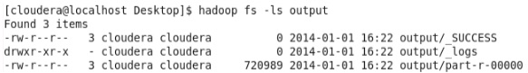
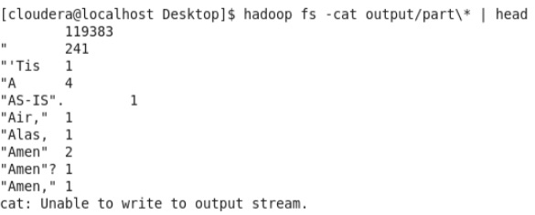

# Hadoop Installation

Generally Hadoop can be run in three modes.

1. **Standalone (or local) mode**: There are no daemons used in this mode. Hadoop uses the local file system as an substitute for HDFS file system. The jobs will run as if there is 1 mapper and 1 reducer.
2. **Pseudo-distributed mode**: All the daemons run on a single machine and this setting mimics the behavior of a cluster. All the daemons run on your machine locally using the HDFS protocol. There can be multiple mappers and reducers.
3. **Fully-distributed mode**: This is how Hadoop runs on a real cluster.

First of all, we need to setup an Hadoop installation to work with.
We will do it by setting up a *pseudo-distributed cluster* on your local machine. This deployment is used to learn how the Hadoop basic components must be installed and configured on a single machine, and how to execute simple Hadoop programs on top of it.

For an easy way to set up a cluster, try [Cloudera Manager](http://archive.cloudera.com/cm5/installer/latest/cloudera-manager-installer.bin) at your own risk on your own cluster. :wink:

## Setting up the Pseudo-Distributed Mode

First of all, we need to setup an Hadoop installation to work with. This document describes how to set up and configure a single-node Hadoop installation so that we can quickly perform simple operations using Hadoop MapReduce and the Hadoop Distributed File System.

### Prerequisites

* GNU/Linux is supported as a development and production platform.
* Java™ SDK must be installed. Hadoop requires Java 7 or a late version of Java 6.
* `ssh` must be installed and `sshd` must be running.

### Preparation

1. Create the `hadoop` user account and login as `hadoop` user.

2. Download [hadoop-1.2.1.tar.gz](https://archive.apache.org/dist/hadoop/core/hadoop-1.2.1/hadoop-1.2.1.tar.gz) in your home folder.

3. Unpack the downloaded Hadoop distribution in you home folder:

        hadoop@localhost> tar zxvf hadoop-1.2.1.tar.gz

    The distribution will be expanded in the `hadoop-1.2.1` folder in your home folder.

4. Check that you can ssh to your local machine without a passphrase:

        hadoop@localhost$ ssh localhost

    If you cannot ssh to localhost without a passphrase, execute the following commands:

        hadoop@localhost$ ssh-keygen -t rsa -P '' -f ~/.ssh/id_rsa
        hadoop@localhost$ cat ~/.ssh/id_rsa.pub >> ~/.ssh/authorized_keys

    The first command will create a private/public pair of keys in the `.ssh` folder in your home folder. If asked for passphrase, leave blank and hit return.
    The second command will append your public key to the list of authorized hosts. Now you can ssh to your local machine without a password/passphrase.

5. Move to the Hadoop distribution folder:

        hadoop@localhost$ cd ~/hadoop-1.2.1

6. Create the `HADOOP_PREFIX` environment variable:

        hadoop@localhost$ export HADOOP_PREFIX=`pwd`

    Note the backticks!

7. Edit the file `conf/hadoop-env.sh` to define at least `JAVA_HOME` to be the root of your Java installation.

8. `export` simply sets an environment variable. The `PATH` environment variable tells to the machine where to look for commands that will be typed:

        hadoop@localhost$ export PATH=$PATH:$HADOOP_PREFIX/bin/

 9. Try the following command:

        hadoop@localhost$ hadoop

    This will display the usage documentation for the `hadoop` script. Now you are ready to start your Hadoop cluster in one of the three supported modes: local (standalone) mode, pseudo-distributed Mode, fully distributed mode.

### Local mode

By default, Hadoop is configured to run in a non-distributed mode, as a single Java process. This is useful for debugging.

The following example copies the unpacked `conf` directory to use as input and then finds and displays every match of the given regular expression. Output is written to the given output directory.

    hadoop@localhost$ mkdir input
    hadoop@localhost$ cp conf/*.xml input
    hadoop@localhost$ hadoop jar hadoop-examples-1.2.1.jar grep input output 'dfs[a-z.]+'
    hadoop@localhost$ cat output/*
    hadoop@localhost$ rm -rf input output

### Pseudo-distributed mode

Hadoop can also be run on a single-node in a pseudo-distributed mode where each Hadoop daemon runs in a separate Java process.

1. Edit the `conf/core-site.xml` file:

        <configuration>
            <property>
                <name>fs.default.name</name>
                <value>hdfs://localhost:9000</value>
            </property>
        </configuration>

2. Edit the `conf/hdfs-site.xml` file:

        <configuration>
            <property>
                <name>dfs.replication</name>
                <value>1</value>
            </property>
        </configuration>

3. Edit the `conf/mapred-site.xml` file:

        <configuration>
            <property>
                <name>mapred.job.tracker</name>
                <value>localhost:9001</value>
            </property>
        </configuration>

4. Format a new distributed-filesystem:

        hadoop@localhost$ in/hadoop namenode -format

5. Start the hadoop daemons:

        hadoop@localhost$ start-all.sh

6. Browse the web interface for the *NameNode* and the *JobTracker*; by default they are available at:

    * *NameNode* - `http://localhost:50070`
    * *JobTracker* - `http://localhost:50030`

7. Copy the input files into the distributed filesystem:

        hadoop@localhost$ hadoop fs -put conf input

8. Run some of the examples provided:

        hadoop@localhost$ hadoop jar hadoop-examples-1.2.1.jar grep input output 'dfs[a-z.]+'

9. Copy the output files from the distributed filesystem to the local filesytem and examine them:

        hadoop@localhost$ hadoop fs -get output output
        hadoop@localhost$ cat output/*

10. Clean up:

        hadoop@localhost$ rm -r output
        hadoop@localhost$ hadoop fs -rmr input output

11. When you're done, stop the daemons with:

        hadoop@localhost$ stop-all.sh

# Hadoop Programming

Now we will see how to develop an Hadoop program in a terminal. In order to manage the complexities of Java and Hadoop dependencies linking, We will leverage Maven.

## Hadoop and Maven

For running a Hadoop job written in Java, we need to create a jar file with
the compiled classes and also include another dependencies of out code. This can
be very time consuming if we do not automatise the tasks.

[Apache Maven](http://maven.apache.org/) allows a project to build using its *project object model* (POM) and a set
of plugins that are shared by all projects using Maven, providing a uniform
**build system**.

Let see how to configure a Apache Maven `pom.xml` file to obtain a single jar with code plus
dependencies ready to be executed on a Hadoop environment.

### Start with an empty `pom.xml` file

Let's start with a simple `pom.xml`. `archetype:generate` can make the work for
us to start the configuration process. It creates the folder structure and a
`pom.xml` with the minimum data required. Change `groupId` and `artifactId` with your
requirements.

    mvn archetype:generate -DgroupId=it.cnr.isti.pad -DartifactId=wordcount \
                           -DarchetypeArtifactId=maven-archetype-quickstart \
                           -DinteractiveMode=false

### Maven directory layout

Maven will create a folder named after the provided `artifactId` (in our case, `wordcount`), including a minimal `pom.xml` file and a folder structure like the following:

    wordcount/src
    ├── main
    │   └── java
    │       └── it
    │           └── cnr
    │               └── isti
    │                   └── pad
    │                       └── App.java
    └── test
        └── java
            └── it
                └── cnr
                    └── isti
                        └── pad
                            └── AppTest.java

Delete/ignore the `test` folder, as well as the `App.java` file. We write our own Java file.

    cd wordcount
    rm -rf src/test
    rm -rf src/main/java/it/cnr/isti/pad/App.java

### Update POM

Add the plugin configuration and the dependencies `org.apache.hadoop:hadoop-client` and `org.apache.hadoop:hadoop-core`.
Version numbers can vary, we currently use version 1.2.1.

    <build>
      <plugins>
        <plugin>
          <artifactId>maven-compiler-plugin</artifactId>
          <version>3.0</version>
          <configuration>
            <source>1.7</source>
            <target>1.7</target>
            <encoding>${project.build.sourceEncoding}</encoding>
          </configuration>
        </plugin>

        <plugin>
          <groupId>org.apache.maven.plugins</groupId>
          <artifactId>maven-jar-plugin</artifactId>
          <configuration>
            <archive>
              <manifest>
                <addClasspath>true</addClasspath>
              </manifest>
            </archive>
          </configuration>
        </plugin>
      </plugins>
    </build>

    <dependencies>
        <dependency>
            <groupId>org.apache.hadoop</groupId>
            <artifactId>hadoop-common</artifactId>
            <version>1.2.1</version>
        </dependency>

        <dependency>
            <groupId>org.apache.hadoop</groupId>
            <artifactId>hadoop-core</artifactId>
            <version>1.2.1</version>
        </dependency>

        [...]

    </dependencies>

### Write code

You can write the source code of your application with any text editor. Here we will use the GNU [`nano`](https://www.nano-editor.org) editor.

    nano src/main/java/it/cnr/isti/pad/WordCount.java

Edit the Java file with content, then close the file (Ctrl+O).

### Compile and package

In the folder containing your `pom.xml` file, run the following command.

    mvn clean package

If compilation and packaging runs smoothly, we will get a new `target` folder, containing the jar file to use to dispatch our application on any Hadoop cluster.

## How to execute a Hadoop programs from Terminal

To test the Hadoop program we just wrote, we will use a small input data set called [`pg100.txt`](../data/pg100.txt).

1. Open a terminal and run the following commands:

        hadoop fs -put pg100.txt pg100.txt
        hadoop jar wordcount-1.0-SNAPSHOT.jar it.cnr.isti.pad.WordCount pg100.txt output

2. Run the following command:

        hadoop fs -ls output

    You should see an output file for each reducer. Since there was only one reducer for this job, you should only see one `part-*` file. Note that sometimes the files will be called `part-NNNNN`, and sometimes they'll be called `part-r-NNNNN`.

    

3. Run the following command:

        hadoop fs -cat output/part* | head

    You should see the same output as when you ran the job locally.

    

    To work with Hadoop distributed file system (HDFS) from the command line, check this [cheatsheet](./hdfs-cheatsheet.md).